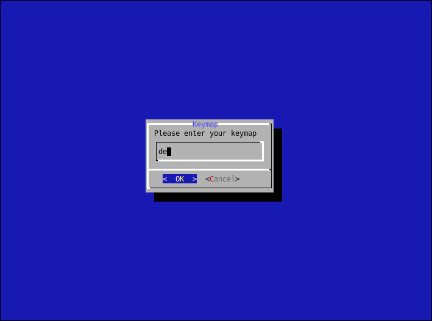

# arch-install
A simple (re)installer script, focused to make encrypted archlinux installations as easy and fast as possible. The main goal of arch-install is to provide a solution to easilly install and re-install archlinux on a full disk encryption. The entire install procedure is based on `dialog`.

## Download
Nightly builds can be obtained below. Those images are built via `archiso` and are patched to include the latest arch-install script.
The latest travis-ci release builds can be reviewed here: [Build Job](https://travis-ci.org/shagu/arch-install/).

* **[↓ Download Installer ISO](https://github.com/shagu/arch-install/releases/latest/download/arch-install.iso)**
* **[↓ Download Installer ISO (Remote)](https://github.com/shagu/arch-install/releases/latest/download/arch-install-ssh.iso)**

*Info: The Remote Image is the same as the regular one, but has SSH without any password enabled by default. This is insecure and should only be used within your local network on headless machines*

## Preview

## Features
* Supports several desktops
* Uses LUKS Encryption
* Uses LVM Volumes
* Compatible to UEFI and BIOS
* Can reuse previous installation (keep /home untouched)
* Remote crypt unlock via ssh on headless machines
* Optional pseudo-crypt (empty disk password)

### Optional: Manually create ISO
First make sure to have `archiso` installed and run the `Makefile`:

    pacman -S archiso
    make

### Optional: Use official Archlinux ISO
1. Download the lastest archlinux live iso
2. Write the iso to an empty USB stick
3. Boot the USB stick
4. Connect your network
5. Download the installer: `wget https://raw.githubusercontent.com/shagu/arch-install/master/arch-install.sh`
6. Run the installer: `./arch-install.sh`
